# Mentoria-typescript 🤓

Projeto desenvolvido junto com a aula de **Desafio de Projeto** ministrada pela Digital Innovation One. Este projeto consiste em alguns exemplos e também, desafios que o professor passou no final do curso para resolver. Os desafios são passar os códigos que estão em Javascript para Typescript, no qual as funções, variáveis e outras coisas deverão estar com tipo ou alguma validação. Todos estes desafios estão na pasta desafios, com suas respectivas propostas e soluções separadas.

No desafio 4, foi utilizada uma **API** do site [TheçMovieDB](https://www.themoviedb.org/) (é necessário fazer cadastro no site para gerar a API Key), porém, além de implementar as variáveis e funções com um tipo, era necessário terminar o código que estava pela metade, que no caso, mandava as *responses* das requisições para o console do navegador e não para a tela. Apenas duas funções estavam implementadas na tela que são: A função de login que mandam o **request-token** e a **sessão** no console e uma busca de filmes. No entanto, eu fiz a implementação dos recursos que estavam faltando, cujos eram: 
  - Criar a lista de filmes que gera um ID para mostrá-la na tela (só é possível criá-la se estiver logado);
  - Adicionar ou remover um filme na lista utilizando o ID deste que foi encontrado na seção de busca;
  - Limpar a lista ou remover todos os filmes de uma vez;
  - Deletar uma lista utilizando o código da própria. (Obs: o comando de deletar a lista gera um erro que é da própria API, mas a lista ainda é deletada do banco de dados).

Segue abaixo alguns screenshots de como ficou (Obs: não foi feito um CSS porque este projeto foi mais para exemplificar requisições utilizando APIs):

## Tela principal do Desafio 4:
  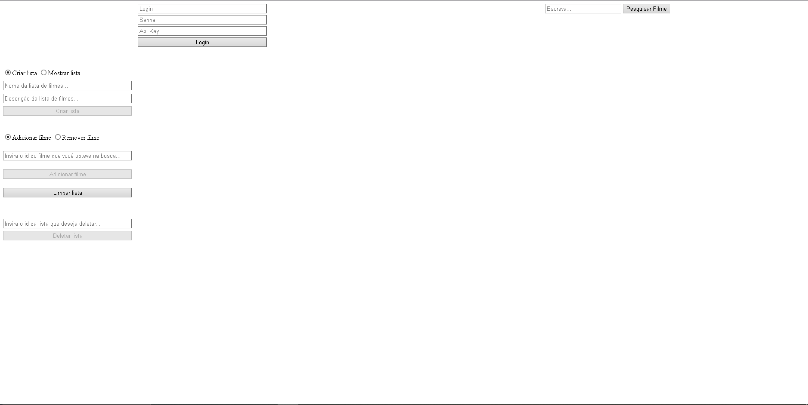

## Criando uma lista:
  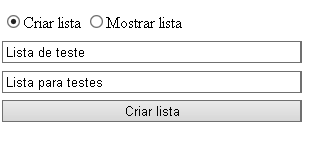
  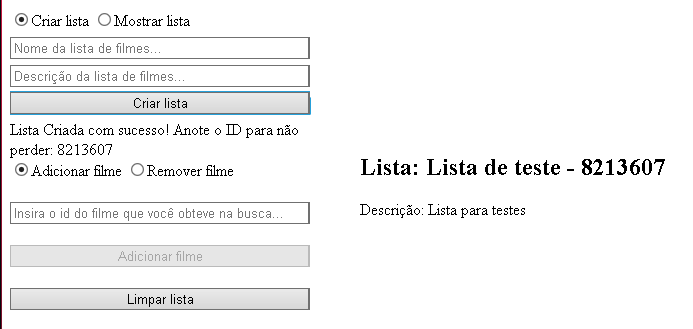

## Adicionando um filme na lista:
  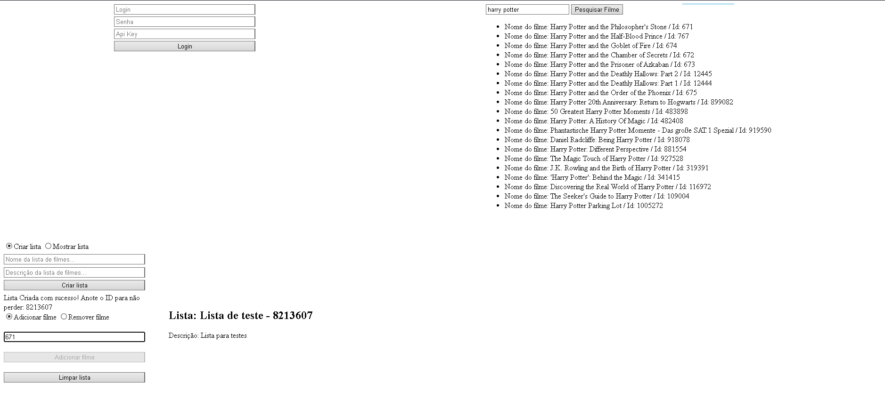
  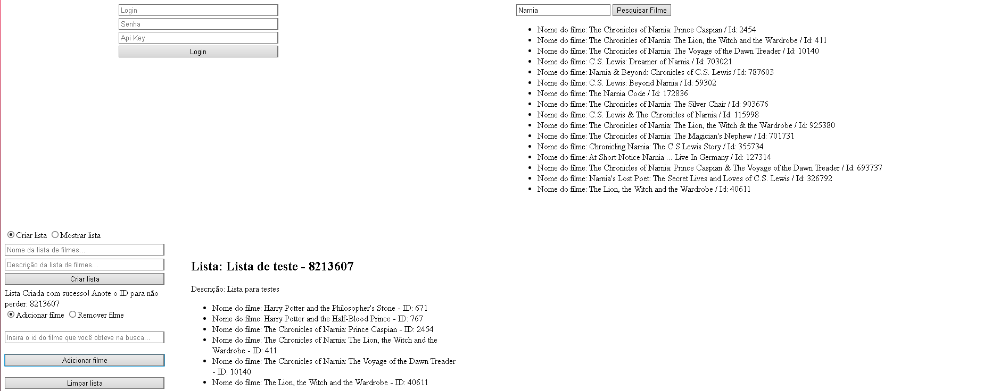

## Procurando um filme:
  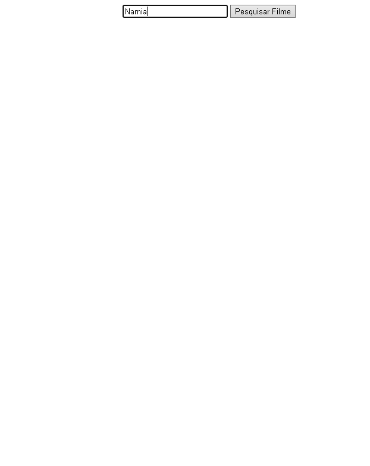
  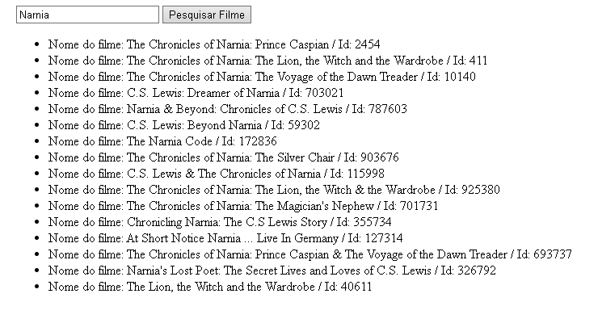

## Removendo um filme:
 (Obs: nesse caso, coloquei dois filmes do mesmo, então eu quero remover um deles)
  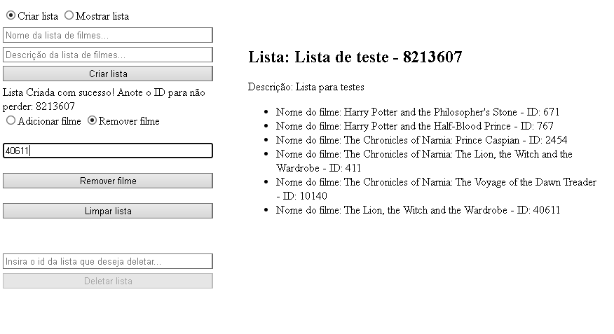
  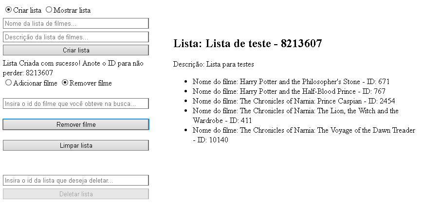

## Limpando a lista:
  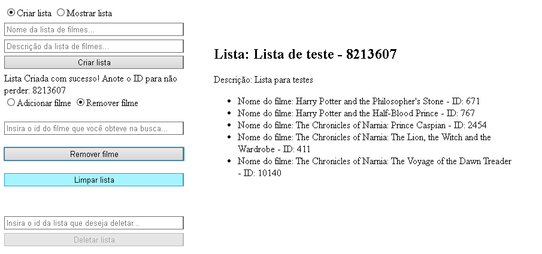
  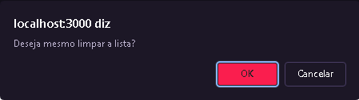
  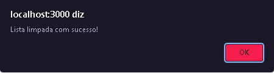
  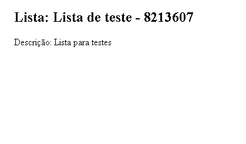

## Deletando a lista:
  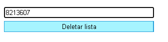
  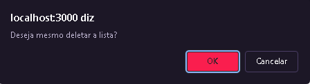
  ### Erro que dá ao deletar a lista:
  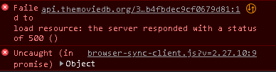
  ### A lista foi deletada mesmo com esse erro:
  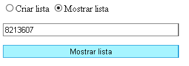
  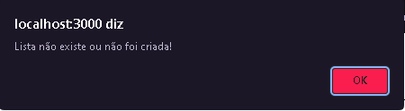

## Comandos disponíveis para rodar o projeto
  Na pasta do projeto, você pode rodar:

  ### `npm install`
  Instalar as dependências do projeto.

  ### `npm start`
  Abre a tela do projeto no <http://localhost:3000> em modo de desenvolvimento para visualizá-la.
  Também, é possível ver erros no código via console.

  ### `npm watch`
  Roda o compilador da linguagem typescript, para que ela atualize os arquivos na pasta dist que estão em Javascript, permitindo que as mudanças sejam mostradas.

  ### `npm test`
  Roda o teste no modo de observação, para ver se está tudo certinho com o projeto.

É isso 😃